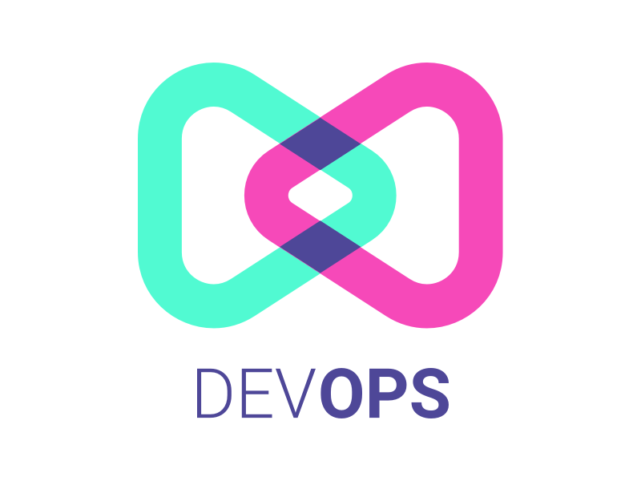

<div id="top"></div>

[![Contributors][contributors-shield]][contributors-url]
[![Forks][forks-shield]][forks-url]
[![Stargazers][stars-shield]][stars-url]
[![Issues][issues-shield]][issues-url]
[![MIT License][license-shield]][license-url]
[![LinkedIn][linkedin-shield]][linkedin-url]


<!-- PROJECT LOGO -->
<br />
<div align="center">
  <a href="https://github.com/ofandoud/ITI-Graduation-Project">
    
  </a>

  <h3 align="center">ITI-Graduation-Project</h3>

  <p align="center">
    Applying full DevOps process on live production app!
    <br />
    <br />
    <br />
    <a href="https://github.com/ofandoud/ITI-Graduation-Project">View Demo</a>
    ·
    <a href="https://github.com/ofandoud/ITI-Graduation-Project/issues">Report Bug</a>
    ·
    <a href="https://github.com/ofandoud/ITI-Graduation-Project/issues">Request Feature</a>
  </p>
</div>


<!-- TABLE OF CONTENTS -->
<details>
  <summary>Table of Contents</summary>
  <ol>
    <li>
      <a href="#about-the-project">About The Project</a>
      <ul>
        <li><a href="#built-with">Built With</a></li>
      </ul>
    </li>
    <li>
      <a href="#getting-started">Getting Started</a>
      <ul>
        <li><a href="#installation">Installation</a></li>
      </ul>
    </li>
    <li><a href="#Roadmap">Roadmap</a></li>
    <li><a href="#contributing">Contributing</a></li>
    <li><a href="#license">License</a></li>
    
  </ol>
</details>


<!-- ABOUT THE PROJECT -->
## About The Project

[![Product Name Screen Shot][product-screenshot]]()

Deploy backend application on cloud provider `GCP - AWS` kubernetes cluster using CI/CD jenkins
pipeline using the following steps:
* Implement secure kubernetes cluster.
* Deploy and configure jenkins on kubernetes using Ansible.
* Deploy backend application on kuberetes using jenkins pipeline.

Use the `Run.sh` to get started.

<p align="right">(<a href="#top">back to top</a>)</p>


### Built With

In this project we used:

* [Terraform](https://www.terraform.io/docs)
* [Ansible](https://docs.ansible.com/)
* [Jenkins](https://www.jenkins.io/doc/)
* [Docker](https://docs.docker.com/)
* [Kubernetes](https://kubernetes.io/docs/home/)
* [GCP](https://cloud.google.com/docs)
* [AWS](https://docs.aws.amazon.com/)
* [BashScript](https://www.gnu.org/savannah-checkouts/gnu/bash/manual/bash.html)

<p align="right">(<a href="#top">back to top</a>)</p>


<!-- GETTING STARTED -->
## Getting Started

To use our project remember to change the cloud credentials to fit your cloud account and other options.


### Installation

1. Clone the repo
   ```sh
   git clone https://github.com/ofandoud/ITI-Graduation-Project.git
   ```
2. Edit the credentials to fit yours cloud account
3. Run `run.sh`

<p align="right">(<a href="#top">back to top</a>)</p>


<!-- ROADMAP -->
## Roadmap

- [x] Add GCP
- [ ] Add AWS
- [ ] Use prometheus
- [ ] Use best practice 

See the [open issues](https://github.com/OFandoud/ITI-Graduation-Project/issues) for a full list of proposed features (and known issues).

<p align="right">(<a href="#top">back to top</a>)</p>


<!-- MARKDOWN LINKS & IMAGES -->
<!-- https://www.markdownguide.org/basic-syntax/#reference-style-links -->
[contributors-shield]: https://img.shields.io/github/contributors/ofandoud/ITI-Graduation-Project.svg?style=for-the-badge
[contributors-url]: https://github.com/OFandoud/ITI-Graduation-Project/graphs/contributors
[forks-shield]: https://img.shields.io/github/forks/ofandoud/ITI-Graduation-Project.svg?style=for-the-badge
[forks-url]: https://github.com/OFandoud/ITI-Graduation-Project/network/members
[stars-shield]: https://img.shields.io/github/stars/ofandoud/ITI-Graduation-Project.svg?style=for-the-badge
[stars-url]: https://github.com/OFandoud/ITI-Graduation-Project/stargazers
[issues-shield]: https://img.shields.io/github/issues/ofandoud/ITI-Graduation-Project.svg?style=for-the-badge
[issues-url]: https://github.com/OFandoud/ITI-Graduation-Project/issues
[license-shield]: https://img.shields.io/github/license/ofandoud/ITI-Graduation-Project.svg?style=for-the-badge
[license-url]: https://github.com/OFandoud/ITI-Graduation-Project/blob/master/LICENSE.txt
[linkedin-shield]: https://img.shields.io/badge/-LinkedIn-black.svg?style=for-the-badge&logo=linkedin&colorB=555
[linkedin-url]: https://www.linkedin.com/in/ofandoud
[product-screenshot]: images/devops-demo.gif


## Contributors


|             |                 |
| :-----------------------------------------: | :------------------------------------------------: |
| [Omar Fandoud](https://github.com/OFandoud) | [Ismael Atallah](https://github.com/IsmaelAtallah) |

<p align="right">(<a href="#top">back to top</a>)</p>


## License
Distributed under the GPL-3.0 License. See LICENSE for more information.

<p align="right">(<a href="#top">back to top</a>)</p>
